 

I have been using Hermes Agent since around the beginning of April. Before that I had experimented with Openclaw, but gave it up after too many faulty updates and poor performance on my Raspberry Pi 5.

In this document I describe my Hermes landscape, my most important use cases, and my experiences.

My background: After spending 36 years in IT (I started out with /390 assembler programming for the [Siemens BS2000](https://en.wikipedia.org/wiki/BS2000) mainframe operating system ...), I now spend my retirement on AI topics.


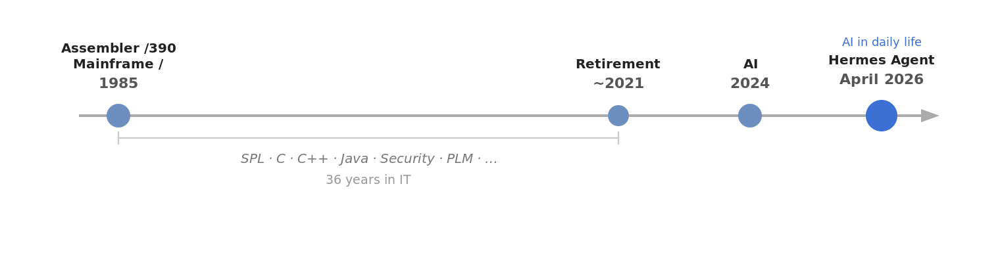
## My Hermes landscape

<p align="center">
  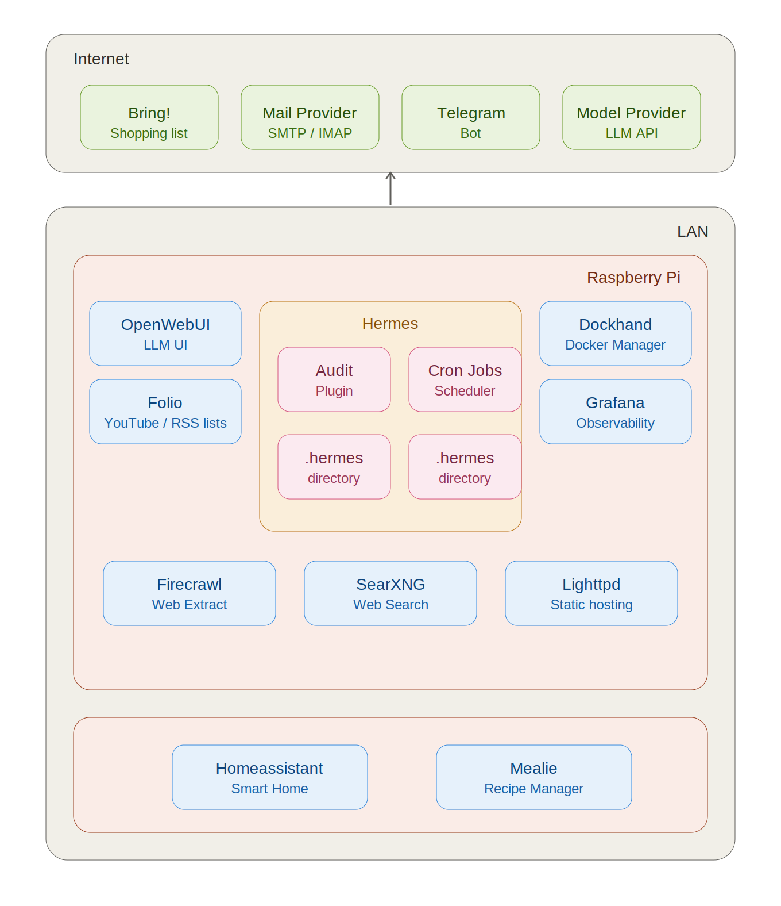
</p>


## Runtime environment

Hermes and most of the supporting applications run on a headless Raspberry Pi 5 with 16 GB RAM and a 1 TB SSD. A portable USB SSD serves as the backup medium.

 <p align="center">
  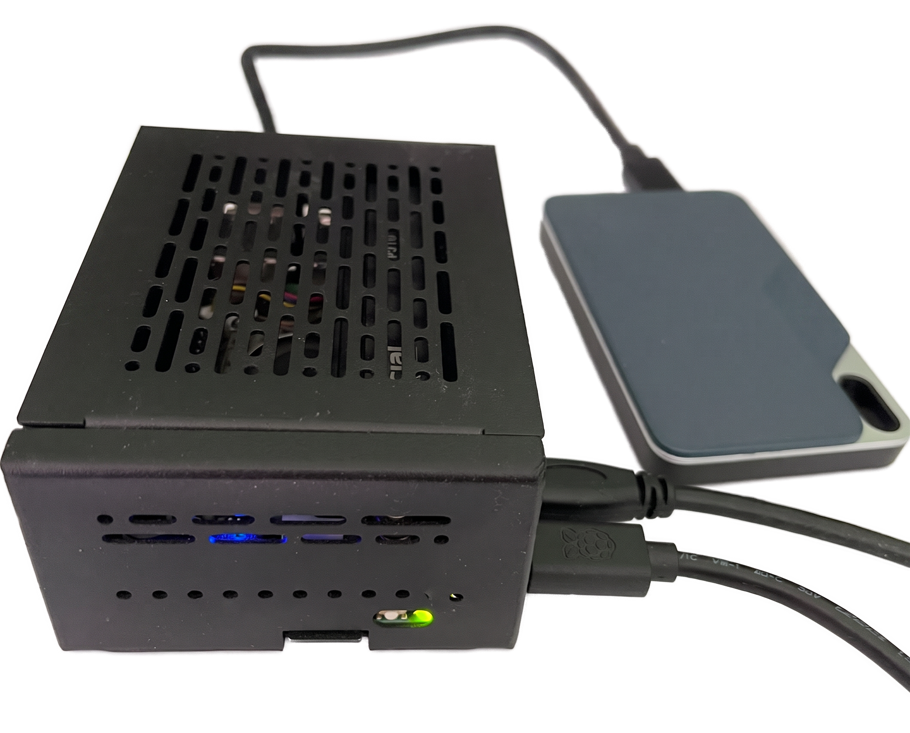
</p>


Each application runs in its own Docker container. I manage containers and images mostly from the terminal; for a better overview I also use [Dockhand](https://dockhand.pro).

 <p align="center">
  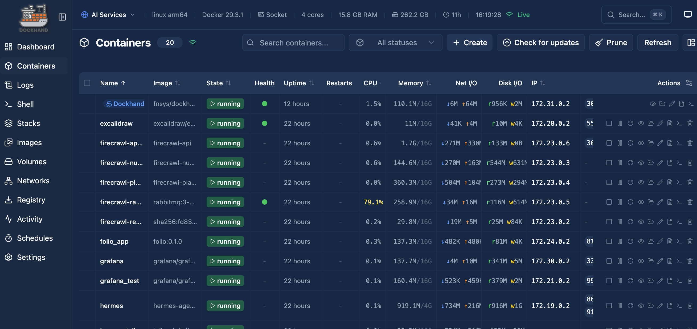
</p>
 

For each application there is a `Makefile` that simplifies management. The standard targets are:


 Target | Purpose  
---------|---------- 
 `up` | Start all containers 
 `down`  | Stop and remove containers 
 `start` |Start stopped containers
 `stop` | Stop running containers without removing them  
`restart` | Restart containers
`logs`  | Follow logs
`pull` | Pull newer images
 `status` |Show container status
`clean` | Stop containers and remove volumes
`update` | Pull images and restart containers
`sh` | Open a shell in the  container
 
## Hermes setup

### Runtime (Docker)

The dashboard also runs inside the Hermes container. Tailscale is integrated into the same Compose file as a "sidecar", so I can reach the dashboard from my phone even when I'm out and about.

Since I want to output some reports as PDF, I build my own Docker image with [Pandoc](https://github.com/jgm/pandoc) and [Typst](https://github.com/typst/typst) installed.

 
### Volumes

Besides the standard `/opt/data` volume, I mount an additional directory (`.merkur`; Merkur is the German name of the Roman god [Mercurius](https://en.wikipedia.org/wiki/Mercury_(mythology)), who corresponds to the Greek god **Hermes**).

```yaml
volumes:
      - ~/apps/data/.hermes:/opt/data
      - ~/apps/data/.merkur:/opt/merkur
```

<p align="center">
  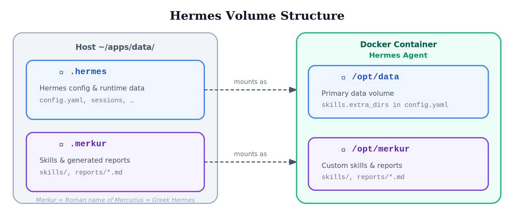
</p>
I use the `.merkur` directory for

- my skills (configured in `config.yaml` under `skills.extra_dirs`)
- storing the generated reports (Markdown files)

### Audit plugins

I have created two audit plugins:

- a **file plugin** that logs to a file
- a **DB plugin** that writes to a SQLite database and is analyzed via Grafana

**Audit File Plugin**

The [Audit File Plugin](https://github.com/nhranitzky/hermes_audit_file_plugin) logs the tool and LLM API calls to a file.

**Audit DB Plugin**

The [Audit DB Plugin](https://github.com/nhranitzky/hermes_audit_db_plugin) writes the tool and LLM API calls to a SQLite database. Grafana dashboards analyze the database, filter it, and display the statistical data.

<p align="center">
  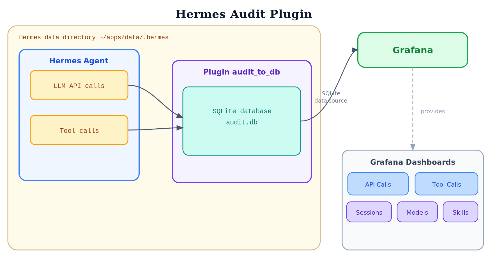
</p>


## Messaging 

I mainly use Telegram as a messaging client and TUI. In addition, I have set up a group with topics to separate conversations by theme.

OpenWebUI is also connected, although its feature set is limited (only OpenAI-compatible chat).


## Self-hosted services

The following applications are integrated with Hermes. They all run as Docker containers in my local network.

Application | Function  
---------|---------- 
 OpenWebUI | Chat interface
 Folio | My application for managing YouTube and RSS channels 
 Grafana | For analyzing the audit DB
Lighttpd | Simple web server for reading the reports
Firecrawl | Service for web_extract
SearXNG | Service for web_search
Home Assistant | My smart home management
Mealie | Recipe management


I'll describe how I use some of these later.

## Models

For the first month I ran everything through OpenRouter with open-weight models: mostly _Qwen 3.6 Plus_ and _Minimax M2.7_. For compaction and `web_extract`, _Gemini 3 Flash_ was configured. Even though I was "only" learning and experimenting, quite a few tokens added up:

- Number of LLM calls: approx. 6,100
- Input tokens: 190 million
- Output tokens: 3.2 million
- Total cost: approx. $82

 <p align="center">
  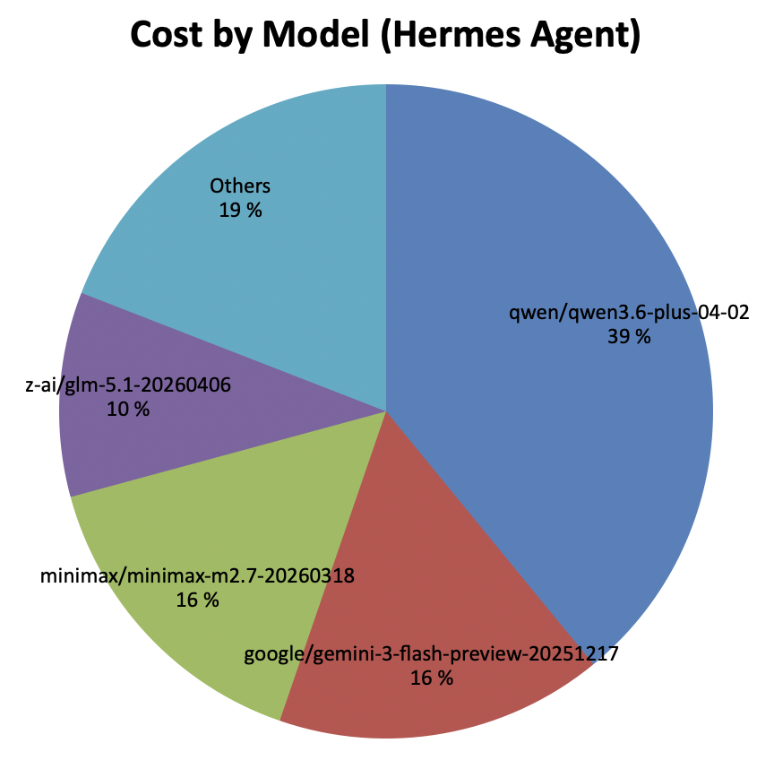
</p>


These costs were the reason to look for a cheaper alternative. Since Anthropic prohibits using the _Claude Pro Subscription_ for agents, I replaced the main model with GPT 5.5 (using a _Codex Pro Subscription_). For my usage the included tokens are more than enough, at only $20 per month.

The quality of my cron reports is significantly better with GPT 5.5 than with Minimax M2.7 — cleaner in language and considerably more concise. With Minimax I also had the problem that the model often generated Chinese characters in the German-language output.
## Skills

Skills are a mechanism for giving an LLM conversation targeted context.

The "skill context" can take three forms:

- Data: a skill can insert "raw data" that is then processed by the model.
- Logic: a skill contains reasoning aids, logic, and workflows that steer the model in a particular direction.
- Action: a skill contains instructions for using tools and CLIs to interact with the environment (passively or actively). The goal is either to obtain more context or to act on the environment.

Of course, a skill can be a mixture of these forms.

<p align="center">
  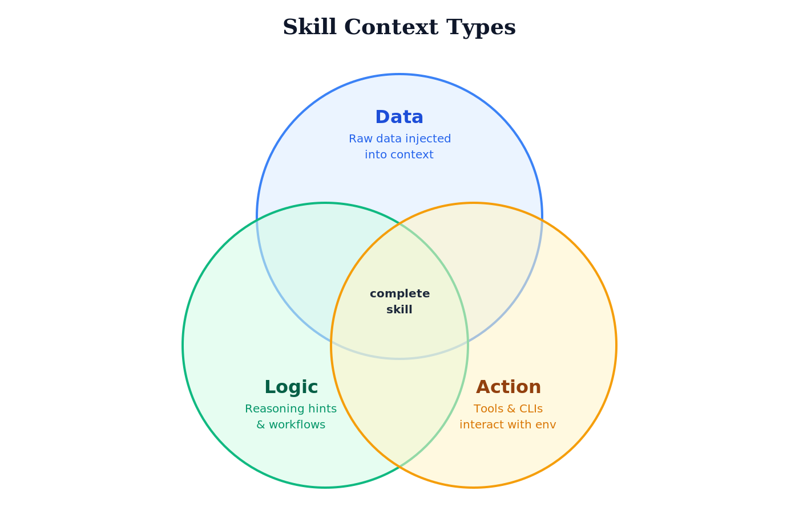
</p>

Skills are normally loaded according to the "progressive disclosure" principle. The list of skills (name, description, category) is loaded into the context first. If the model decides, based on this data, to use a skill, Hermes loads the SKILL.md via the `skill_view` tool — and, if needed, any reference files in a further step.

<p align="center">
  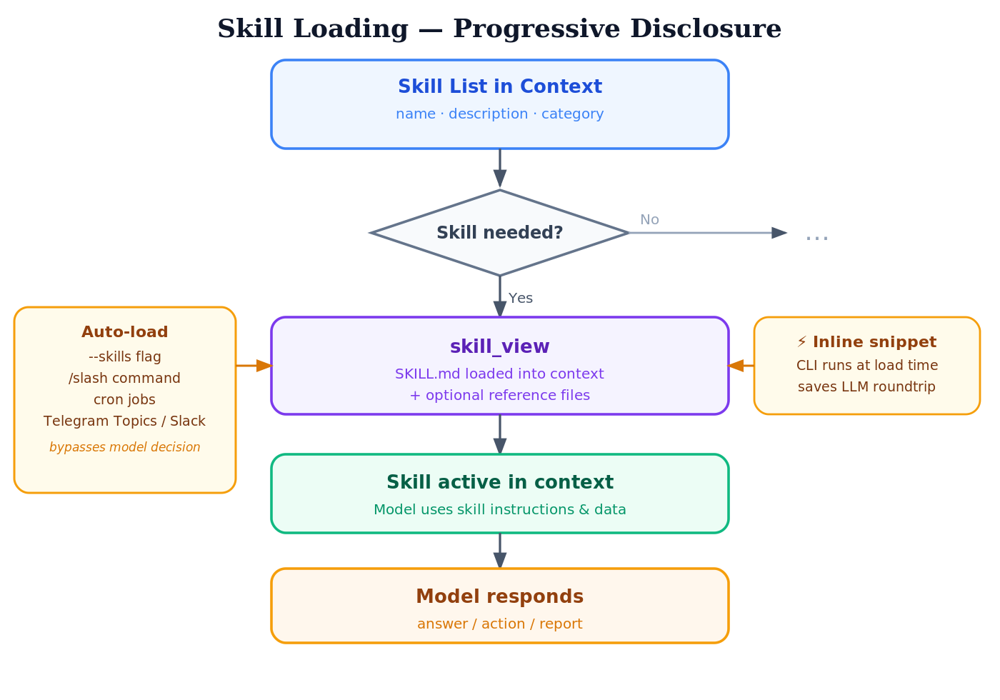
</p>

In certain cases, Hermes lets you "preload" skills (auto-load):

- Starting a CLI session: `hermes --skills skill1,skill2`
- With a "skill slash command" in a chat: `/skillname`
- When starting cron jobs
- For Telegram topic sessions and Slack, skills can be loaded automatically

The CLI calls defined in a skill are normally triggered by the model. Hermes has a so-called "inline shell snippets" mechanism that lets you run a CLI as early as loading time (`skill_view`) to fill the context with data. The advantage is that you save a round trip in the LLM conversation. The mechanism makes sense when you don't need the model to parameterize the CLI call.


My first goal was to learn how to develop skills. I started by developing skills that provide an interface to existing services.
Here is a list:

- The `bring` skill provides access to the shopping list service [Bring!](https://www.getbring.com/en/home). It is much easier to enter the list of groceries to buy via Telegram than via the app. When shopping, you can simply check off the groceries in the app.

- The `mealie` skill for my self-hosted [Mealie](https://mealie.io) service. In Mealie I manage my recipes. I have Hermes search the internet for new recipes. When a recipe appeals to me, I instruct Hermes to import it into my Mealie app.

- The `dwdweather` skill uses the data of the German Weather Service (DWD) via the [Bright Sky](https://brightsky.dev/) API.

- The `fuel-prices` skill can query fuel prices (the cheapest price, price comparisons, etc.) at a specific location or in a specific area via the Market Transparency Unit for Fuels (MTS-K) in Germany (live data).

- I also have my own mail skill implementation (IMAP/SMTP). One difference from the `himalaya` skill is that only user/password authentication is supported. However, you can configure an "allowlist" – the skill can only send mail to these email addresses; the script checks this.

- Another skill provides the real-time data of the Munich transit company (MVG): departures, route planning, and current service disruptions.

- I also have my own skill for finding new entries in RSS feeds, and a skill for finding new YouTube videos in a channel list. What's special is that the RSS feed list and the YouTube channel list (both structured by category) can also be managed by a self-developed application (`Folio`). I can manage the lists via a UI, but also via the skill. The filtering (by time and category) happens in the script, so the model already receives the filtered list of videos or RSS entries.

- Another skill enables printing to my network printers (text file, PDF, or a web page).

- I manage my books in an app (`BookBuddy`) on my phone. I export the book list to a CSV file, which a skill can then access (without changing the list).

- The reports I have generated are also formulated as skills — more on that later.

### Implementations

**Coding Agent**

I developed the skills with Claude Code, mostly with Sonnet 4.6. Sometimes, when Sonnet got stuck on a problem, I switched to Opus. Since a skill project is manageable, I did not use any complex skills for development. At first I used plan mode, later the small but excellent [grill-me](https://github.com/mattpocock/skills/tree/main/skills/productivity) skill by Matt Pocock.

**Programming Language and Libraries**
The scripts are all written in Python. For formatting the text output I use [rich](https://github.com/textualize/rich), and for implementing the commands I use [Typer](https://typer.tiangolo.com).

**Project Structure**

I created the first versions of the skills in a single project together with the scripts. Meanwhile I am rewriting the skills and separating the development:

- in one project, only the CLI is created first, so the tool can also be used standalone (installable with uv tools). The CLIs have both a text output and a JSON output. In skills I use the JSON output.
- The pure skill project, based on the CLI interface, only creates the SKILL.md file. To be able to use the tool in the skill without any Python-specific call, the Python tool is started via a shell launcher (wrapper).

The script paths are converted into absolute paths by Hermes via the `HERMES_SKILL_DIR` environment variable when the script is read in, so that they are reliably found at runtime (previously it was very model-dependent whether the correct directory was found).

```bash
${HERMES_SKILL_DIR}/bin/dwdweather summary Berlin --output json
```
Of course, Hermes can create skills itself. On the one hand I wanted to gain experience with skill development; on the other hand, in "workflow" skills (like the reports) I wanted to use the CLIs directly, without the detour via the corresponding skills. This saves tokens and makes the process more deterministic.

Here is an example: to determine the list of new videos in the AI category, I use the new "inline shell snippets" feature:

```bash
!`/opt/merkur/skills/youtube/scripts/youtubectl video list --categories "AI" --hours 25 --json`
```

The list is then already executed during `skill_view` and inserted into the skill. This saves not only reading in another skill, but also an LLM round trip: the model does not have to generate any tool calls.

**Data Formats**
At first I had both text and JSON output for every CLI. However, JSON is too "verbose" for an LLM. [Benchmarks](https://toonformat.dev/guide/benchmarks) show: with a more compact format like TOON, you can save a significant number of tokens.
As an experiment, I switched the `dwdweather` CLI to also support TOON. Here is the comparison (I used `tiktoken` as the tokenizer):

```text
Command             JSON B   TOON B   B-Save   JSON T  TOON T   T-Save   
------------------------------------------------------------------------ 
current              1,839    1,466    20.3%      678     564    16.8%   
forecast hourly     47,026   38,010    19.2%   14,881  12,089    18.8%   
forecast daily       2,096      996    52.5%      699     420    39.9%   
history hourly      27,703   21,937    20.8%    8,350   6,762    19.0%   
history daily        2,342    1,162    50.4%      818     499    39.0%   
alerts                 396      303    23.5%      143     112    21.7%   
stations             6,344    2,395    62.2%    2,236   1,177    47.4%   
summary              3,909    2,051    47.5%    1,320     843    36.1%   
------------------------------------------------------------------------ 
TOTAL               91,655   68,320    25.5%   29,125  22,466    22.9%   
```

<p align="center">
  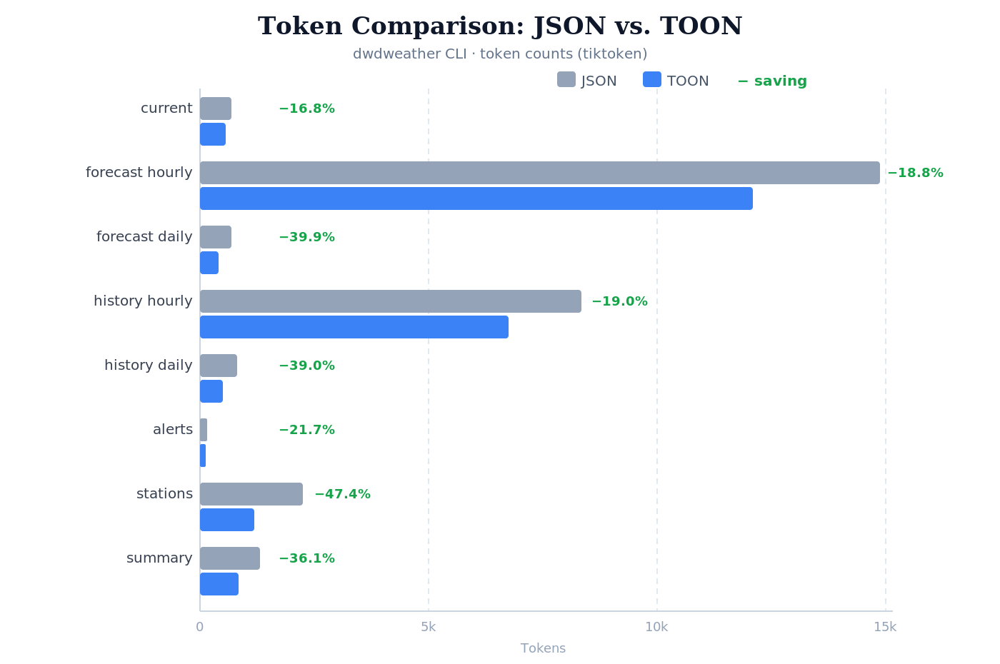
</p>

For smaller outputs the savings are not that high, but with many and larger outputs they add up. With the switch to TOON and by filtering the data through the CLI call (rather than through the LLM), [Infracost](https://www.infracost.io/resources/blog/we-cut-claude-s-token-usage-79-by-redesigning-our-cli-for-agents) achieved a 79% token saving (with Claude).

### Own skills for CLI and skill development

With the development of every CLI and skill I learned something new. Out of that, two skills emerged: one for CLI development in Python, and one for skill development that builds on it. Neither is quite "stable" yet, though.

 
### Hermes skill improvement

A special feature of Hermes is that it continuously improves skills itself.
I keep my own skills in an "external" directory that was, until now, "protected" from changes by Hermes. After the fix in [PR #17512](https://github.com/NousResearch/hermes-agent/pull/17512), the skills in external directories are also improved/modified.

On the one hand, I like it when my skills are improved. But when I develop my skills further and load them back into Hermes, I overwrite the Hermes changes because I didn't even notice them.

My solution is that I set up the external skill directory as a Git repo, so I can easily see which skills were changed and what was changed.

```bash
$ git status
On branch master
Changes not staged for commit:
  (use "git add <file>..." to update what will be committed)
  (use "git restore <file>..." to discard changes in working directory)
        modified:   bring/SKILL.md
        modified:   reports/ai-news/SKILL.md

Untracked files:
  (use "git add <file>..." to include in what will be committed)
        dwdweather/scripts/dwdweather.egg-info/
        reports/ai-news/references/cron-report-runbook.md

no changes added to commit (use "git add" and/or "git commit -a")

$ git diff
>>>>  show changes 
```
## My use cases

So far I have not used Hermes for programming. For that I use Claude Code and sometimes Codex.

My main use cases are:

- Generating daily/weekly reports
- Product/solution research
- Searching for recipes
- Managing the shopping list
- Using Home Assistant

### Reports

#### Prompts/skills

In the first version I defined the prompts for the cron jobs in a Markdown file and referenced it when creating the cron job:

```bash
hermes cron create "20 8 * * *" "Process the prompt in the file /opt/merkur/prompt/ai-news.md"
```

Hermes very quickly turned this prompt into a skill. Although the generated skill referenced the original prompt file, I had the impression that not every change to the prompt file took effect in the skill.

As a result, I defined the reports themselves as skills.

#### Content

The following reports are generated by Hermes:

- Daily:
    - Political news from around the world and from Germany. The skill is configured with a list of important news portals, which the LLM evaluates and turns into a report.
    - Local news: news about my place of residence
        - Updates from newspapers and the local portal
        - Weather for the day
        - Fuel prices at the gas stations in the area
        - Disruptions in public transport
        - Offers from the local grocery stores

    - House-related news:
        - Next garbage collection
        - Forecast for our PV system for the day
    - AI news
        - New YouTube videos in my AI channel list 
        - New YouTube videos with the tag #hermesagent
        - Transcript summary of a relevant YouTube video (the LLM determines relevance)
        - New entries from my RSS channel list
        - Summary of the discussion about Hermes (r/hermesagent) on Reddit

- Weekly
    - Exhibitions: Based on the list of museums in Munich, a current list of art exhibitions is compiled every week.
    - New AI books: every week a list of new books about AI is compiled (Amazon, Manning, O'Reilly, Pearson, Springer)
    - AI news, with a different focus than the daily report:
        - Search the web for major AI announcements, model releases, and research breakthroughs
        - Search for trending ML repositories on GitHub
        - Check arXiv for highly-cited papers on language models and agents

<p align="center">
  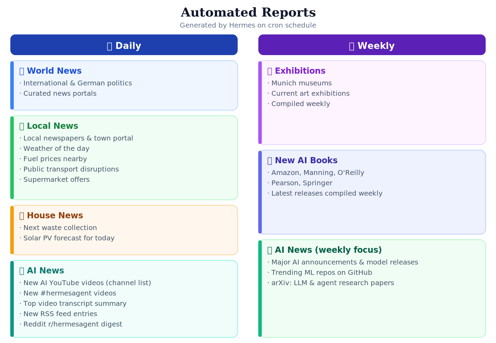
</p>

#### Storage

 The reports are stored in the mounted directory, organized by date

```text
reports/
└── 2026/
    └── 01/
        ├── 01/
        │   ├── world-news.md
        │   ├── local-news.md
        │   ├── house-news.md
        │   └── ai-news.md
        ├── 02/
        │   └── ...
        ├── Week_1/
        │   ├── exhibitions.md
        │   └── ai-books.md
        └── ...
```

The cron jobs don't notify me when they're done, but since they run at fixed times I know when to expect the reports.

#### Reading

Hermes runs on a headless Raspberry Pi. With a [lighttpd](https://www.lighttpd.net) server I can navigate the report directory and read the Markdown file in the browser (using the JavaScript library [Marked](https://marked.js.org)). On the go, I can also reach the reports from my phone via the sidecar container with Tailscale.


To read and search the reports on my Mac as well, they are mirrored into Obsidian using the Obsidian plugin [rsync](https://github.com/ganapathyraman/rsync-plugin).

<p align="center">
  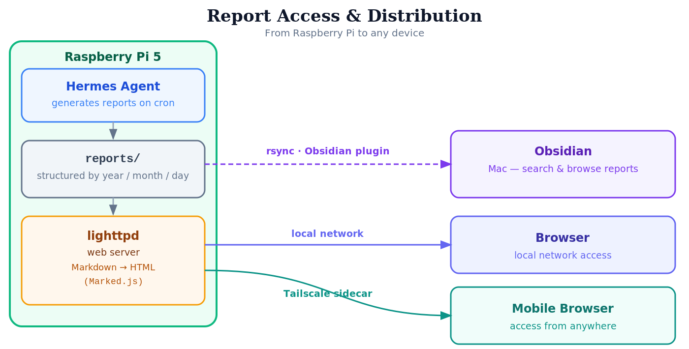
</p>

#### Costs


The statistics and costs of the individual reports (based on the GPT 5.5 API costs):

| Report | Number of API Calls | Number of Tool Calls | Input Tokens | Output Tokens | Cached Read Tokens | Total Tokens | Total Cost Tokens (\$) |
|---|---|---|---|---|---|---|---|
| World News | 10 | 11 | 89649 | 11194 | 337408 | 438251 | 0.952769 |
| Local News | 6 | 14 | 42531 | 7139 | 164864 | 214534 | 0.509257 |
| House News | 11 | 30 | 49912 | 3836 | 396800 | 450548 | 0.563040 |
| AI News | 17 | 18 | 86954 | 8721 | 445440 | 541115 | 0.919120 |
| **SUM** | **44** | **73** | **269046** | **30890** | **1344512** | **1644448** | **2.944186** |

With other models the costs (assuming comparable token usage) would be:

| Model | Total Cost ($) | 
|-------|----------------| 
|GPT 5.5|2.944186 |
|Minimax M2.7|0.19845252 |
|Kimi 2.6|0.64033768  |

<p align="center">
  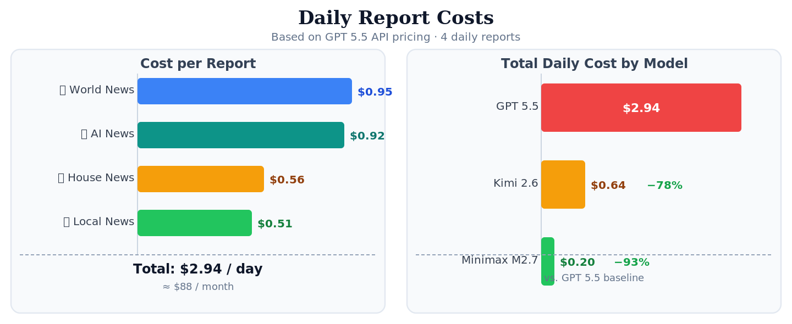
</p>


### Managing the shopping list

My [bring](https://github.com/nhranitzky/bring-skill) skill provides access to the shopping list service [Bring!](https://www.getbring.com/en/home). It is much easier to enter the list of groceries to buy via Telegram than via the app. When shopping, you can simply check off the groceries in the app.

 <p align="center">
  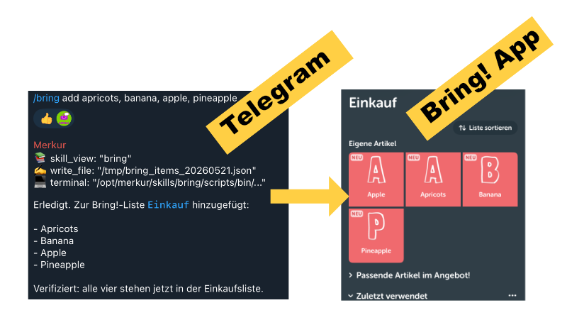
</p>
 

### Searching and managing recipes

For quite some time I have had a self-hosted [Mealie](https://mealie.io) application in which I manage our recipes.

When I feel like a new recipe, I search the internet for new recipes with Hermes (Hermes also learns what I usually like ...). When a recipe appeals to me, Hermes imports it into my application using the [mealie](https://github.com/nhranitzky/mealie-skill) skill. Afterwards I could also have the ingredients added straight to the Bring! shopping list.

When I'm then in the kitchen, I ask Hermes (via Telegram with speech-to-text) for the recipe. Unfortunately, Hermes can't cook yet ...

### Product research

I also use Hermes quite often for product research. Hermes has already created a `product-research` skill for this. If the analysis and recommendations look good, I save them to the report directory.


### Home Assistant

Hermes integrates Home Assistant at the tool level.


So what does all this cost? The table below shows the cost per prompt.

| Call | Number API Calls | Number of Tool Calls | Input Tokens | Output Tokens | Cached Read Tokens | Total Tokens | Total Cost (\$) |
|---|---|---|---|---|---|---|---|
| Is the house door open? | 2 | 1 | 25,659 | 100 | 5,120 | 30,879 | 0.133855 |
| Turn on the Canvas light | 3 | 2 | 13,216 | 86 | 34,304 | 47,606 | 0.085812 |
| How much electricity will my solar panels produce today? | 4 | 9 | 47,504 | 776 | 103,936 | 152,216 | 0.312768 |
| Take a picture with my webcam | 9 | 8 | 16,290 | 947 | 132,096 | 149,333 | 0.175908 |


As a basis I used the GPT 5.5 API costs (Input: \$5 per M tokens; Read Cache: \$0.5 per M tokens; Output: \$30 per M tokens). With Kimi 2.6 the PV query would cost only \$0.06 — a fifth of the cost with GPT 5.5.

A summer day of PV electricity (≈ 30 kWh, worth about \$11) thus funds around 120 such queries with GPT 5.5! 
## Memory

Currently I use the built-in memory system and additionally Holographic Memory. I still need to dig deeper into the topic of memory; by now there are a great many solutions: from those that store everything, to those that deliberately "dream" and forget in order to distill what's relevant.

## Kanban board

I did try the Kanban board, but so far I have seen no need to switch over my cron jobs. I also assume that bigger changes are still coming here.

The question is also whether a Kanban board is sufficient just for the agent tasks. When you work on a project, you have not only the agent tasks but also your own, manual tasks — a pure agent board then falls short.

## Profiles

Hermes' solution for multi-agent setups is the profile. A profile has:

- its own data area
- a completely separate configuration
- its own gateway process

When you run Hermes in Docker, using profiles is a bit more cumbersome. You can create a new profile, but to start its own gateway you have to start a separate Hermes Docker container.

I tested the following setup:

- One Docker container (for the default profile); within this container, I create additional profiles.
- For each profile, I create a separate container that mounts the same volumes as the default one, but with HERMES_HOME set to the profile’s directory.

With this setup, I can do the following:

- In the default container, I use the Kanban board to create tasks for all profiles. They all run in the default container. I can also run cron jobs and Telegram, etc., with the default profile. The kanban board works with multiple profiles - it does not require those profiles to have a gateway running. 
- In each profile-specific container, I can run cron jobs, Telegram, etc., independently.

This solution is the normally preferred one, if you want to follow the principle "[one service per container](https://docs.docker.com/engine/containers/multi-service_container/)". But is a second gateway process a new service? I think no. 

I implemented a proof-of-concept ([hermes-multiprofile-docker](https://github.com/nhranitzky/hermes-multiprofile-docker)) running multiple profile gateway processes in one container, managed by `supervisord`.

 <p align="center">
  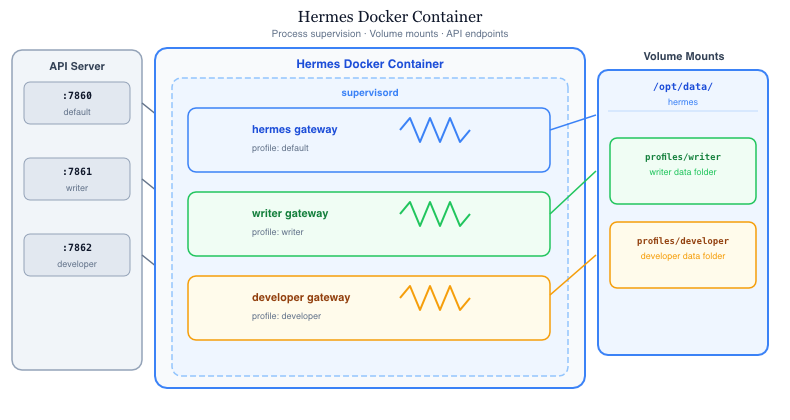
</p>
 

This approach is straightforward to implement: no changes to the Hermes codebase are required, only the Docker startup scripts need to be changed; the profiles are detected automatically.

---
Update (2026-05-29): Hermes now fully [supports](https://hermes-agent.nousresearch.com/docs/user-guide/docker) profiles in Docker. The implementation is similar to mine; however, Hermes uses [s6-overlay](https://github.com/just-containers/s6-overlay) to supervise and manage the gateway and dashboard processes.
---

 

## What I still plan to do

Hermes is addictive. I've resolved to devote more time to other interesting topics, but I'm staying on it; here are a few Hermes topics I want to tackle soon:

- Dig into the topic of memory
- Compare skill vs. MCP (time, tokens, …)
- A skill that suggests recipes for a week. It takes the recipes in my Mealie application into account and searches the internet for new recipes, proposing three menus per day that I can then choose from. Afterwards it compiles the shopping list.
- Look for further useful use cases for private use

So, that's enough for now. By the way: to shut down Hermes, I tap the Morse code for V (· · · –) on the Ikea Bilresa switch:

<p align="center">
  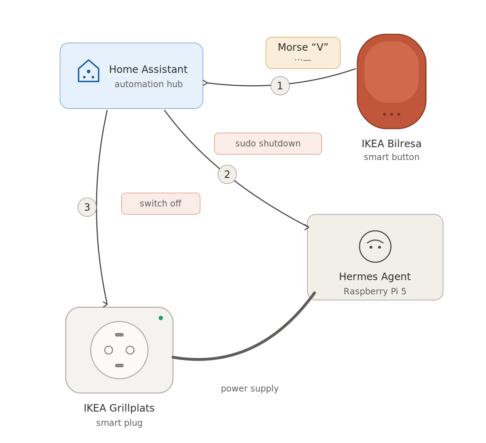
</p>


---
This text was originally written in German and translated with AI (Claude Opus 4.7).